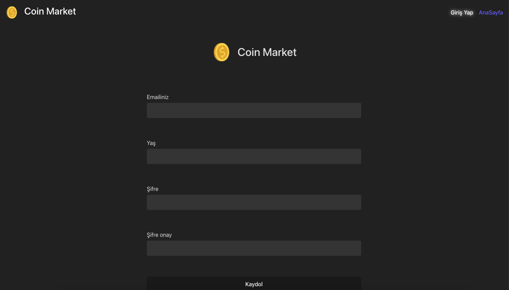
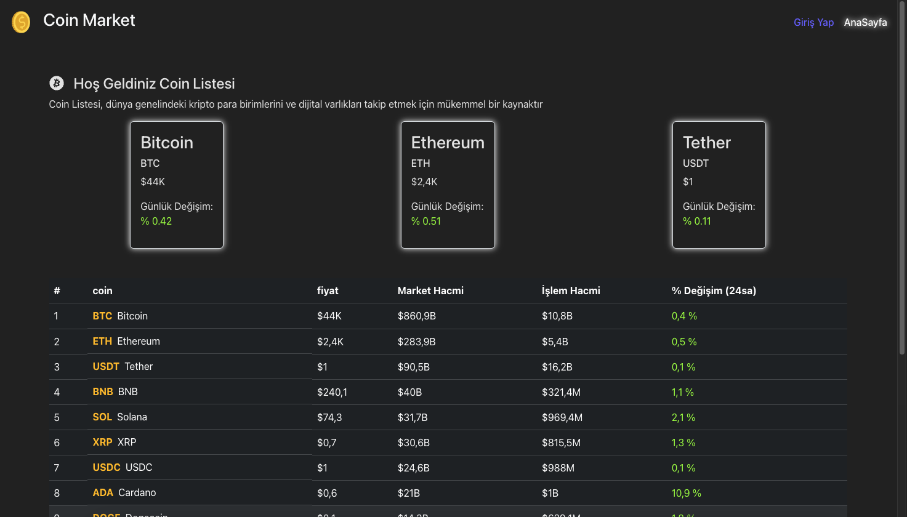
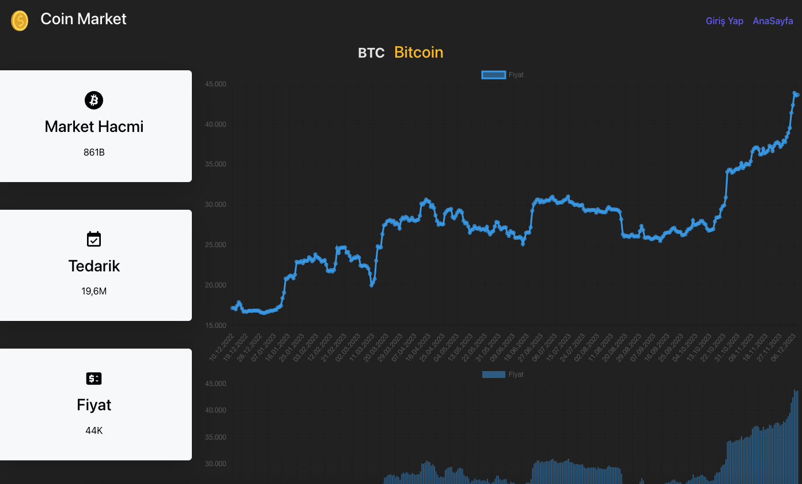

# Formik ve Yup Libraris to use form

formlardaki kontrolü sağlamak için fromik ve yup kütüphaneleri kullanılır. bu kütüphaneler ile formlarda girilen değerlerin geçerli olup olmadığını kontrol etmek çok basittir. 

1. Formik ve yup indirilmesi

`npm i formik yup`

2. Formik kütüphanesi iki şekilde kullanılabilir.
    2.1 Bileşen olarak formik kullanılabilir. Kullanımı kolaydır fakat çok fazla özelleştirilemezler.
    2.2 useFormik hook u ile kullanımı ile daha özelleştirilebilir formlar oluşturulabilir.
Herhangi bir geçersiz veri girildiğinde gönder butonu çalışmaz ve hangi inputa geçersiz veri girildiği ise bunu error() metodu ile döndürür

3.  Formik kütüphanesinin kullanımı 

```javascript
import { useFormik } from 'formik'

 const formik = useFormik({
        //formda tutulacak verilerin ilk değerleri verilir.
        initialValues:{
            email:'',
            age:'',
            password: '',
            confirmPassword:''
        },
        //form gönderildiğinde çalışan fonksiyon
        onSubmit:(values,actions)=> {
             console.log(values)
        },
        // todo : doğrulama şeması

            //formdaki verilerin geçerlilik durumunu belirleme
        validationSchema:schema
    })
```
inputtaki verilerin değişimini incelemek için onchange() metodu içerisinde formik kütüphanesinde bulunana handleChange() metodu kullanılır.
` <input onChange={formik.handleChange} type={type} name={name} />`

4. yup kütüphanesi: formdaki verilerin geçerlilik kriterlerini belirlemek için yup kütüphanesi kullanılır.

```javascript
import * as yup from 'yup'

export const schema = yup.object().shape({
    email:yup
    .string()
    .email('Lütfen geçerli bir email giriniz')
    .required('Email alanı zorunludur'),

    age:yup
    .number()
    .min(18,'Yaş değeri 18 den büyük olmalı')
    .max(100,'Yaş yüzden büyük olamaz')
    .integer('Lütfen Tam sayı giriniz'),

    password:'',
    confirmPassword:''
})
```

# coin project 
- coin api den veriler çekildi ve detay sayfasında çizgi ve sütün grafiklerinde bir coin nin detayları gösterildi.





